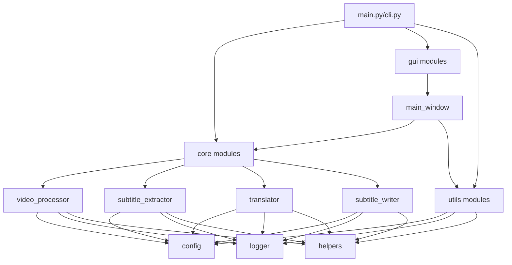

# 项目文件结构说明
# Project File Structure

本文档详细说明了视频翻译器项目的文件组织结构和各个模块的功能。

## 📁 项目根目录

```
video_translator/
├── 📄 README.md                    # 项目主文档和使用指南
├── 📄 INSTALL.md                   # 详细安装指南
├── 📄 CHANGELOG.md                 # 版本更新日志
├── 📄 PROJECT_SUMMARY.md           # 项目总结和技术文档
├── 📄 FILE_STRUCTURE.md            # 本文件 - 项目结构说明
├── 📄 LICENSE                      # MIT开源许可证
├── 📄 requirements.txt             # Python依赖包列表
├── 📄 config.yaml                  # 应用默认配置文件
├── 📄 .env.template                # 环境变量配置模板
├── 📄 run.py                       # 跨平台统一启动脚本
├── 📄 run.bat                      # Windows批处理启动脚本
├── 📄 test_basic.py                # 基础功能测试套件
├── 📁 src/                         # 源代码目录
├── 📁 logs/                        # 日志文件目录 (运行时创建)
├── 📁 output/                      # 默认输出目录 (运行时创建)
└── 📁 temp/                        # 临时文件目录 (运行时创建)
```

## 📂 源代码结构 (src/)

```
src/
├── 📄 main.py                      # GUI应用程序入口点
├── 📄 cli.py                       # 命令行界面入口点
├── 📁 core/                        # 核心功能模块
│   ├── 📄 video_processor.py       # 视频处理引擎
│   ├── 📄 subtitle_extractor.py    # 字幕提取和解析器
│   ├── 📄 translator.py            # AI翻译管理器
│   └── 📄 subtitle_writer.py       # 字幕文件输出器
├── 📁 gui/                         # 图形用户界面
│   ├── 📄 main_window.py           # 主窗口界面
│   ├── 📄 dialogs.py               # 对话框组件 (待扩展)
│   └── 📄 widgets.py               # 自定义UI组件 (待扩展)
└── 📁 utils/                       # 工具和辅助模块
    ├── 📄 config.py                # 配置管理系统
    ├── 📄 logger.py                # 日志系统
    └── 📄 helpers.py               # 通用辅助函数
```

## 📋 文件功能详解

### 🗂️ 根目录文件

| 文件名 | 类型 | 功能描述 |
|--------|------|----------|
| `README.md` | 文档 | 项目主文档，包含功能介绍、使用方法、安装说明 |
| `INSTALL.md` | 文档 | 详细的安装指南和环境配置说明 |
| `CHANGELOG.md` | 文档 | 版本更新历史和变更记录 |
| `PROJECT_SUMMARY.md` | 文档 | 项目技术总结和架构说明 |
| `LICENSE` | 许可证 | MIT开源许可证文本 |
| `requirements.txt` | 配置 | Python依赖包列表和版本要求 |
| `config.yaml` | 配置 | 应用程序默认配置文件 |
| `.env.template` | 模板 | 环境变量配置模板，用户需复制为.env |
| `run.py` | 启动脚本 | 跨平台Python启动脚本，支持GUI和CLI模式 |
| `run.bat` | 启动脚本 | Windows批处理启动脚本，提供交互式菜单 |
| `test_basic.py` | 测试 | 基础功能测试套件，验证核心功能 |

### 🏗️ 核心模块 (src/core/)

#### 📄 video_processor.py
- **功能**: 视频文件处理核心引擎
- **主要类**: `VideoProcessor`, `VideoInfo`, `SubtitleStream`
- **核心功能**:
  - 视频文件信息分析 (分辨率、时长、编码等)
  - 字幕轨道检测和提取
  - 支持多种视频格式
  - FFmpeg集成和错误处理
  - 音频提取和缩略图生成

#### 📄 subtitle_extractor.py
- **功能**: 字幕文件解析和处理
- **主要类**: `SubtitleExtractor`, `SubtitleFile`, `SubtitleSegment`
- **核心功能**:
  - 多格式字幕解析 (SRT, VTT, ASS, SSA, SUB, TXT)
  - 字幕时间轴处理
  - 文本清理和格式化
  - 字幕片段分割和合并
  - 编码检测和处理

#### 📄 translator.py
- **功能**: AI翻译服务集成和管理
- **主要类**: `TranslationManager`, `BaseTranslator`, `TranslationResult`
- **支持的AI服务**:
  - OpenAI GPT (gpt-3.5-turbo, gpt-4)
  - Anthropic Claude (Claude-3系列)
  - Google Cloud Translation API
  - Azure Translator服务
- **核心功能**:
  - 多提供商统一接口
  - 异步批量翻译
  - 上下文感知翻译
  - 错误处理和重试机制

#### 📄 subtitle_writer.py
- **功能**: 翻译后字幕文件输出
- **主要类**: `SubtitleWriter`, `SRTFormatter`, `VTTFormatter`, `ASSFormatter`
- **核心功能**:
  - 多格式字幕输出 (SRT, VTT, ASS)
  - 双语/单语字幕生成
  - 自定义文件名模板
  - 字幕验证和质量检查
  - 备份和恢复功能

### 🖥️ 用户界面 (src/gui/)

#### 📄 main_window.py
- **功能**: 图形用户界面主窗口
- **主要类**: `VideoTranslatorGUI`, `ProgressDialog`
- **核心功能**:
  - 现代化GUI界面设计
  - 文件选择和批量处理
  - 实时进度显示
  - 翻译设置配置
  - 日志监控和错误显示
  - 多主题支持

### 🔧 工具模块 (src/utils/)

#### 📄 config.py
- **功能**: 配置管理系统
- **主要类**: `Config`
- **核心功能**:
  - YAML配置文件管理
  - 环境变量加载
  - 默认配置合并
  - API密钥验证
  - 动态配置更新

#### 📄 logger.py
- **功能**: 日志系统
- **主要类**: `LoggerManager`, `PerformanceLogger`, `TranslationLogger`
- **核心功能**:
  - 结构化日志记录
  - 彩色控制台输出
  - 文件日志轮转
  - 性能监控
  - 翻译进度跟踪

#### 📄 helpers.py
- **功能**: 通用辅助函数库
- **核心功能**:
  - 文件格式检测和验证
  - 时间格式转换
  - 文本处理和清理
  - 系统信息获取
  - 进度跟踪工具
  - 线程安全工具类

### 🚀 应用入口点

#### 📄 src/main.py
- **功能**: GUI应用程序入口
- **核心功能**:
  - 环境检查和初始化
  - GUI应用启动
  - 异常处理和日志记录

#### 📄 src/cli.py
- **功能**: 命令行界面入口
- **主要类**: `VideoTranslatorCLI`
- **核心功能**:
  - 命令行参数解析
  - 批量文件处理
  - 进度条显示
  - 错误处理和恢复

## 🗃️ 运行时目录

以下目录在应用首次运行时自动创建：

```
video_translator/
├── 📁 logs/                        # 日志文件存储
│   ├── 📄 app.log                  # 应用运行日志
│   ├── 📄 translation.log          # 翻译过程日志
│   └── 📄 error.log                # 错误日志
├── 📁 output/                      # 默认输出目录
│   └── 📄 [翻译后的字幕文件]        # 用户生成的字幕文件
└── 📁 temp/                        # 临时文件目录
    └── 📄 [临时字幕文件]            # 处理过程中的临时文件
```

## 📊 代码统计

| 模块 | 文件数 | 代码行数 | 主要功能 |
|------|--------|----------|----------|
| 核心模块 (core) | 4 | ~2000行 | 视频处理、字幕提取、AI翻译 |
| 界面模块 (gui) | 1 | ~800行 | 图形用户界面 |
| 工具模块 (utils) | 3 | ~1500行 | 配置、日志、辅助函数 |
| 入口脚本 | 2 | ~900行 | 应用启动和CLI |
| 测试文件 | 1 | ~400行 | 基础功能测试 |
| 启动脚本 | 2 | ~600行 | 跨平台启动支持 |
| **总计** | **13** | **~6200行** | **完整的视频翻译解决方案** |

## 🔗 模块依赖关系



## 📝 扩展指南

### 添加新的翻译提供商
1. 在 `translator.py` 中继承 `BaseTranslator` 类
2. 实现 `translate()` 方法
3. 在 `TranslationManager` 中注册新提供商
4. 更新配置文件和文档

### 添加新的字幕格式
1. 在 `subtitle_extractor.py` 中添加解析方法
2. 在 `subtitle_writer.py` 中添加格式化器类
3. 更新 `supported_formats` 配置
4. 添加相应的测试用例

### 扩展GUI功能
1. 在 `gui/` 目录下创建新的组件文件
2. 在 `main_window.py` 中集成新组件
3. 更新配置文件以支持新功能
4. 添加相应的事件处理逻辑

## 🏷️ 文件命名规范

- **模块文件**: 使用蛇形命名法 (snake_case)
- **类名**: 使用帕斯卡命名法 (PascalCase)
- **函数名**: 使用蛇形命名法 (snake_case)
- **常量**: 使用大写字母和下划线 (UPPER_CASE)
- **配置文件**: 使用小写字母和点分隔
- **文档文件**: 使用大写字母和下划线分隔

## 📋 总结

视频翻译器项目采用模块化设计，结构清晰，职责分明。每个模块都有明确的功能定位，便于维护和扩展。通过统一的配置管理和日志系统，确保了应用的稳定性和可调试性。

项目文件组织遵循Python项目的最佳实践，支持跨平台部署，具有良好的可扩展性和可维护性。